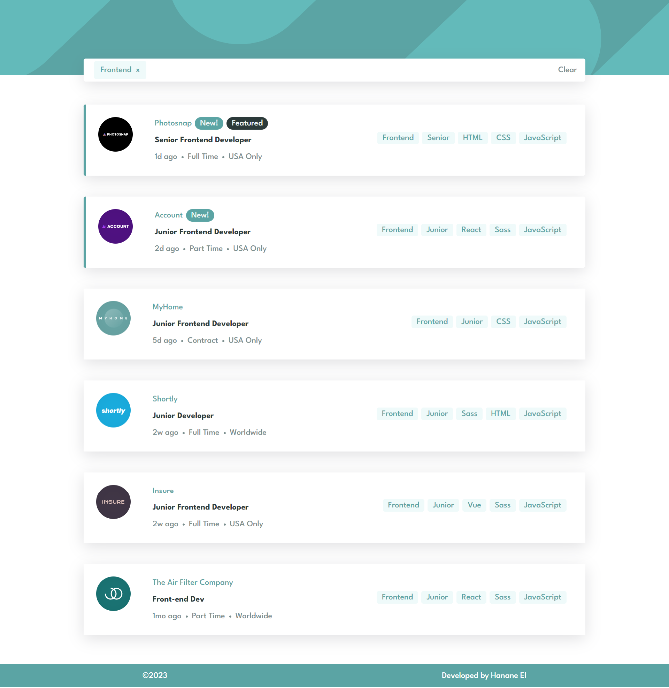

# Frontend Mentor - Job listings with filtering solution

This is a solution to the [Job listings with filtering challenge on Frontend Mentor](https://www.frontendmentor.io/challenges/job-listings-with-filtering-ivstIPCt).

## Table of contents

- [Overview](#overview)
  - [The challenge](#the-challenge)
  - [Screenshot](#screenshot)
  - [Links](#links)
- [My process](#my-process)
  - [Built with](#built-with)
  - [What I learned](#what-i-learned)

## Overview

### The challenge

Users should be able to:

- View the optimal layout for the site depending on their device's screen size
- See hover states for all interactive elements on the page
- Filter job listings based on the categories

### Screenshot

Desktop Version

Active states

Mobile Version

### Links

- Live Site URL: [Click here](https://job-listing-rosy.vercel.app/)

## My process

### Built with

- Tailwindcss
- Mobile-first workflow
- [React](https://reactjs.org/) - JS library

### What I learned

This marks my second experience with Tailwind CSS, and I've found myself growing more confident with its usage. I've also picked up some new tips along the way. As for React, I employed the useState and useEffect hooks. Familiarity with these hooks made the process feel quite seamless, as I had already worked with them before.
